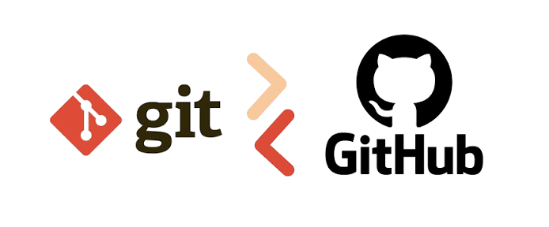

<div align="center"></div>

# Fundamentos Git e GitHub

Este repositório é um espaço dedicado a centralizar anotações de estudo e resumos práticos sobre controle de versão. O objetivo principal é documentar a jornada de aprendizado, desmistificando os conceitos e criando uma base sólida de conhecimento para consultas rápidas.

## Objetivos de Aprendizagem

* **Compreender o conceito de versionamento:** Entender como ele elimina a necessidade de criar várias cópias do mesmo arquivo (o famoso trabalho-final-v2.doc) e protege o histórico do projeto.
* **Diferenciar o Git do GitHub:** Ter clareza absoluta de que o Git é o "motor" que roda no seu computador, enquanto o GitHub é a "nuvem" onde você armazena e compartilha seu código.
* **Dominar a arquitetura local do Git:** Entender a jornada de um arquivo através das três áreas principais: Diretório de Trabalho (Working Directory), Área de Preparação (Staging Area) e Histórico/Repositório (Repository).
* **Entender a dinâmica da nuvem:** Compreender o que são repositórios remotos e a diferença entre enviar código (Push) e baixar código (Pull).
* **Executar o ciclo básico na prática:** Conseguir abrir o terminal, iniciar um repositório do zero, registrar alterações (git init, git add, git commit) e enviar o seu projeto de forma segura para o GitHub (git push).

## Versionamento de Código

O versionamento (ou controle de versão) é um sistema responsável por registrar e gerenciar todas as alterações feitas em um arquivo ou conjunto de arquivos ao longo do tempo.

**O problema que ele resolve:** <br />A principal utilidade do controle de versão é eliminar a prática de salvar múltiplas cópias de um mesmo trabalho para não perder o progresso (ex: `projeto.txt`, `projeto_v2.txt`, `projeto_final_agora_vai.txt`). Ele organiza e automatiza esse processo.

Em vez de duplicar arquivos, o sistema atua como uma "máquina do tempo". Ele salva "fotografias" (estados) do seu projeto em momentos específicos, permitindo a navegação por toda a linha do tempo do desenvolvimento.

**Principais vantagens:**

* **Histórico Detalhado:** Permite saber exatamente **quem** alterou o código, **o que** foi modificado, **quando** ocorreu a mudança e o **porquê** (através das mensagens de registro).
* **Segurança e Reversão (Rollback):** Se uma nova linha de código quebrar o sistema, é possível reverter o projeto de forma cirúrgica para a última versão funcional.
* **Trabalho em Paralelo:** É a base para o trabalho em equipe na área de tecnologia. Permite que várias pessoas alterem o mesmo projeto simultaneamente, unindo o trabalho de todos de forma inteligente no final, sem sobreposições destrutivas.
* **Experimentação Segura:** Possibilita criar ramificações (linhas do tempo paralelas) para testar novas ideias sem risco de comprometer o projeto principal.

## Git

O **Git** é o sistema de controle de versão mais utilizado no mundo, criado em 2005 por Linus Torvalds (o mesmo criador do sistema operacional Linux). Ele é classificado como um sistema de controle de versão **distribuído**. Isso significa que cada computador possui uma cópia local completa de todo o histórico do projeto, não dependendo exclusivamente de um servidor central para a maioria das tarefas.

**Principais características:**
* **Desempenho Local:** Como o histórico completo fica na sua própria máquina, operações como visualizar versões anteriores ou verificar diferenças são quase instantâneas, e não exigem conexão com a internet.
* **Integridade dos Dados:** O Git garante a segurança do código utilizando criptografia (hash SHA-1). É impossível que o histórico seja corrompido ou alterado acidentalmente sem que o sistema detecte.
* **Gestão de Ramificações (Branches):** O Git tornou a criação de ramificações um processo extremamente leve e rápido. Isso facilita a criação de ambientes isolados para desenvolver novas funcionalidades sem afetar a versão principal e estável do projeto.

---

### Como funciona a Arquitetura do Git?

Para dominar o Git, é essencial entender que ele não salva os arquivos de uma vez só. Ele gerencia as alterações transitando os arquivos entre três estados (ou áreas) principais:

| Área | Descrição | Ação / Comando |
| :--- | :--- | :--- |
| **1. Working Directory** (Diretório de Trabalho) | É a pasta do projeto no seu computador. O ambiente real onde você cria, edita ou exclui seus arquivos no dia a dia. | *Edição manual de arquivos* |
| **2. Staging Area** (Área de Preparação) | É a "sala de espera". É o local onde você seleciona e agrupa as alterações específicas que farão parte da próxima versão gravada. | `git add` |
| **3. Repository** (Repositório / Histórico) | É o banco de dados do Git (a pasta oculta `.git`). Onde ele guarda permanentemente o registro (commit) com o estado exato dos seus arquivos. | `git commit` |

**O Ciclo de Vida (Fluxo Básico):**
1. Arquivos são modificados no **Working Directory**.
2. As mudanças desejadas são adicionadas à **Staging Area** (preparadas).
3. O pacote de mudanças na Staging Area é confirmado e gravado de forma permanente no **Repository**.

## GitHub

Enquanto o Git é o "motor" que roda no seu próprio computador, o **GitHub** é uma plataforma baseada na nuvem projetada para hospedar repositórios Git. Ele adiciona uma camada de interface gráfica e ferramentas avançadas de colaboração em cima do controle de versão padrão.

**Qual a diferença fundamental?**
Git é a ferramenta (o sistema). GitHub é o serviço na web. Para fazer uma analogia: o Git seria como o programa de edição de texto no seu computador, enquanto o GitHub seria o Google Drive onde você salva, compartilha e edita esse texto em conjunto com outras pessoas.

**Principais funções:**
* **Hospedagem e Backup (Cloud):** Mantém cópias do seu código seguras em servidores remotos, protegendo contra perdas locais.
* **Colaboração Aberta e Fechada:** Permite que equipes inteiras, em qualquer lugar do mundo, trabalhem no mesmo código de forma simultânea e organizada.
* **Portfólio Profissional:** Funciona como um currículo vivo e público. É o principal local onde recrutadores avaliam as habilidades técnicas e o histórico de projetos de pessoas da área de tecnologia.

---

### Como funciona a dinâmica do GitHub?

O ecossistema do GitHub funciona baseando-se na sincronização entre o seu repositório local (sua máquina) e um repositório remoto (na nuvem). 

Para que essa comunicação e fluxo de trabalho aconteçam, é necessário entender os conceitos de rede do Git:

| Conceito / Ação | O que significa na prática? |
| :--- | :--- |
| **Remote** | É a ponte de conexão. O repositório na nuvem geralmente recebe o apelido padrão de `origin` no seu terminal local. |
| **Clone** (`git clone`) | Ação de fazer o download de um repositório inteiro (que já existe no GitHub) para a sua máquina local pela primeira vez. |
| **Push** (`git push`) | Ação de "empurrar". Envia os seus *commits* (histórico salvo) da sua máquina para o repositório remoto no GitHub. É o seu "upload". |
| **Pull** (`git pull`) | Ação de "puxar". Baixa atualizações do GitHub para o seu ambiente local. Usado para sincronizar sua máquina com alterações feitas por outras pessoas da equipe. |
| **Pull Request (PR)** | É o recurso colaborativo mais importante do GitHub. Trata-se de um pedido formal para que sua equipe revise o código novo antes de integrá-lo definitivamente à versão oficial e principal do projeto. |


## Mão na Massa (Guia Prático)

Aqui está o fluxo de trabalho passo a passo para iniciar um repositório do zero, versionar arquivos e enviá-los para o GitHub.

### Passo 1: Configuração Inicial e Criação (Local)
No terminal, navegue até a pasta do seu projeto e execute:

```bash
# Inicia um novo repositório Git na pasta atual (cria a pasta oculta .git)
git init

# Verifica o status atual dos arquivos (o que foi alterado, criado, etc.)
git status
```
### Passo 2: Preparando e Salvando (Local)
Após modificar ou criar novos arquivos, registre as alterações no histórico do Git passando pela Staging Area:

```bash 
# Adiciona todos os arquivos modificados e novos na Staging Area
git add .

# (Alternativa) Adiciona apenas um arquivo específico
git add nome-do-arquivo.txt

# Salva as alterações no histórico (Repository) com uma mensagem descritiva
git commit -m "Adiciona a estrutura inicial do projeto"
```

### Passo 3: Conectando com o GitHub e Enviando (Remoto)
Vá até o GitHub, crie um novo repositório vazio (sem README ou .gitignore) e copie a URL fornecida. Depois, volte ao terminal para conectar seu projeto local à nuvem:

```Bash
# Garante que a branch principal tenha o nome padrão 'main'
git branch -M main

# Conecta o seu repositório local ao endereço do GitHub (criando o vínculo 'origin')
git remote add origin https://github.com/SEU_USUARIO/NOME_DO_REPOSITORIO.git

# Envia o seu código para o GitHub (Push) e vincula a branch local à remota (-u)
git push -u origin main
```

### Resumo do Fluxo Diário
Depois que o repositório já está configurado e conectado ao GitHub (Passos 1 e 3 já foram feitos uma vez), o ciclo de trabalho do dia a dia se resume a três comandos simples:

```Bash
git add . #Prepara

git commit -m "Sua mensagem" #Salva localmente

git push #Envia para a nuvem
```